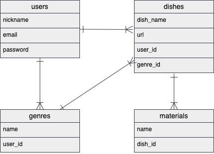
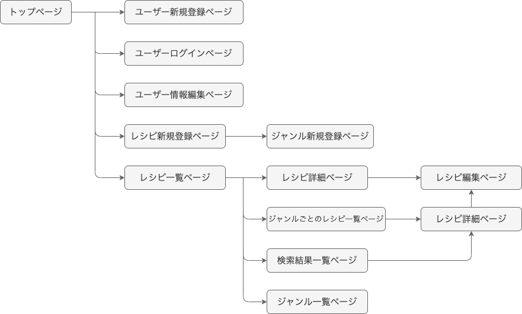

# アプリケーション名

Cook Note（クックノート）

 

# アプリケーション概要

レシピ管理アプリ。  
レシピを投稿・共有するアプリではなく、自分だけのレシピ集を作ることを目的としたアプリ。クックパッドやクラシルなどのレシピサイトに掲載されたレシピ、YouTubeやTikTokのレシピ動画など、多数のレシピの中から気になったレシピや一度作ったレシピを一箇所にまとめて保存・管理しておくことができる。  

 

# URL

 
 

# テスト用アカウント
- Basic認証パスワード：2222
- Basic認証ID：admin
- メールアドレス：test@com
- パスワード：123456  

 

# 利用方法

### レシピ登録

1. ユーザー新規登録を行う  
2. ヘッダーのレシピ新規保存ボタンから、新規保存ページに遷移する  
3. 料理名、外部サイトのURL（任意）、ジャンル（任意）を入力して「保存する」ボタンを押す
4. 一覧ページに登録したレシピが保存されていることが確認できる。またジャンルを指定している場合、サイドバーのジャンル名をクリックすると、ジャンルごとのレシピ一覧を表示させることができる。

 

### 材料登録

1. レシピ一覧画面（もしくはジャンルごとのレシピ一覧画面）で料理名をクリックするとレシピ詳細が表示される  
2. 材料追加ボタンをクリックすると、材料追加フォームが表示される  
3. 材料名を入力して「追加」ボタンを押す
4. 追加した材料が表示される

 

### 検索（ヘッダーから）

1. ヘッダーの「料理名で検索する」もしくは「材料名で検索する」ボタンをクリックすると、検索フォームが表示される  
2. 料理名もしくは材料名を入力して検索すると、自身が登録しているレシピから検索にヒットしたレシピが一覧で表示される  

### 検索（レシピ詳細から）

1. レシピ一覧画面（もしくはジャンルごとのレシピ一覧画面）で料理名をクリックするとレシピ詳細が表示される 
2. レシピ詳細の材料名をクリックすると、材料名での検索が行われる
3. 自身が登録しているレシピから、材料名にヒットしたレシピが一覧で表示される

 
 

# アプリケーションを作成した背景

レシピサイトの数が増えたことで、「保存したレシピの管理が難しい」という課題があることが判明した。  
この課題を解決するために、クックパッドやクラシル、YouTubeなどのレシピを、一箇所にまとめて保存しておくことができるアプリケーションを開発することにした。

 
 

# 洗い出した要件

[要件定義シート](https://docs.google.com/spreadsheets/d/1WEjg-1hAYh5G1MOyV269G1_-04HixccSOAoLfY8aNks/edit#gid=982722306)

 

# 実装した機能についての画像やGIFおよびその説明

 
 

# 実装予定の機能

- 料理ごとに作った日を記録しておくことができる機能
- 「簡単さ」「作りやすさ」などを５段階で評価できる機能

 
 

# データベース設計

 
 

<!-- ### usersテーブル

| Column             | Type    | Options                   |
| ------------------ | ------- | ------------------------- |
| nickname           | string  | null: false               |
| email              | string  | null: false, unique: true |
| encrypted_password | string  | null: false               |

- has_many :dishes
- has_many :genres

### dishesテーブル

| Column      | Type       | Options                         |
| ----------- | ---------- | ------------------------------- |
| dish_name   | string     | null: false                     |
| url         | string     |                                 |
| user        | references | null: false,  foreign_key: true |
| genre       | references | foreign_key: true               |

- belongs_to :user
- belongs_to :genre
- has_many :materials

### genresテーブル

| Column   | Type       |                                |
| -------- | ---------- | ------------------------------ |
| name     | string     | null: false                    |
| user     | references | null: false, foreign_key: true |

- has_many :dishes
- belongs_to :user

### materialsテーブル（材料）

| Column   | Type       |                                |
| -------- | ---------- | ------------------------------ |
| name     | string     | null: false                    |
| dish     | references | null: false, foreign_key: true |

- belongs_to :dish -->

  

 
 

# 画面遷移図  

 
 

  

 
 

# 開発環境

- Ruby
- Ruby on Rails
- My SQL
- Github
- Render
- Visual Studio Code

 
 

# ローカルでの動作確認方法

以下のコマンドを順に実行  
% git clone https://github.com/gaku1114/recipi-management.git  
% cd xxxxx  
% bundle install  
% yarn install

 
 

# 工夫したポイント

- レシピや材料はもちろん、ジャンルについてもそれぞれのユーザーで自由に設定できるようにすることで、カスタマイズ要素を強めた。  
- 材料追加機能や材料削除機能などを同ページで行えるようにして、ページ遷移を少なくし、ユーザビリティを向上させた。

